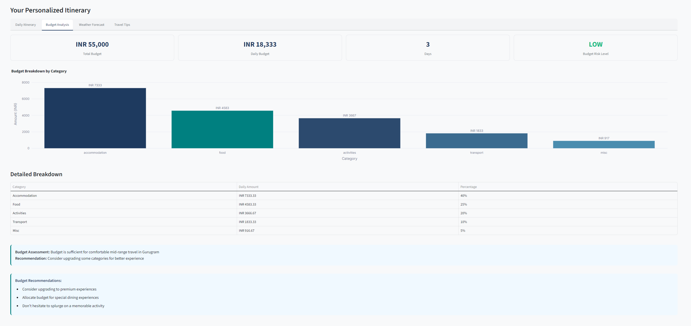

# Agentic Travel Itinerary Planner

<div align="center">

[](https://streamlit.io)
[](https://groq.com)
[](https://python.org)
[](https://langchain.com)

**Enterprise-Grade AI Travel Planning System**

*Plan your trip in 30 seconds with intelligent multi-agent orchestration*

[Features](#features) • [Architecture](#architecture) • [Installation](#installation) • [Usage](#usage) • [Configuration](#configuration)

</div>

---

## Tool Preview

<div align="center">



*Figure: Budget Analysis section of the tool output showing 5-category breakdown, quality risk assessment, and visual charts*

</div>

---

## Overview

The Agentic Travel Itinerary Planner is an enterprise-grade travel planning system that leverages multiple AI agents to generate personalized, comprehensive travel itineraries. Built on Groq's high-performance LLM API, the system delivers weather forecasts, budget breakdowns, and day-by-day activity plans in seconds.

### What It Does

Simply enter your destination, budget, and interests. Get back:

- ✅ **3-day weather forecast** with temperature details
- ✅ **5-category budget breakdown** (accommodation, food, activities, transport, misc)
- ✅ **Day-by-day itinerary** with morning, afternoon, and evening activities
- ✅ **Local cuisine suggestions** for each day
- ✅ **Hidden cost warnings** (resort fees, baggage fees, airport transport)
- ✅ **Quality risk assessment** (alerts if budget is too low for destination)

---

## Features

### Interest-Based Personalization

The system curates activities based on your specific interests:

| Interest Category | Supported Interests |
|-------------------|---------------------|
| Culture & History | sightseeing, history, museums, art, culture |
| Food & Dining | food, specific cuisines (Israeli, Italian, local) |
| Adventure & Nightlife | adventure sports, clubbing, party, nightlife |
| Shopping | shopping, handicrafts, local markets |
| Photography | photography |

### Smart Budget Planning

- **Multi-currency support**: INR, USD, EUR, GBP, JPY, CAD, AUD, SGD, CNY
- **5-category allocation** with intelligent percentages
- **Quality risk assessment** based on destination and budget
- **Hidden cost detection** for common travel expenses
- **Budget recommendations** when funds are limited

### Multi-Agent Architecture

| Agent | Responsibility | LLM Model |
|-------|---------------|-----------|
| **Research Agent** | Destination research, weather, attractions | Groq Llama 3.3 70B |
| **Budget Agent** | Cost analysis, currency conversion, risk assessment | Groq Llama 3.3 70B |
| **Logistics Agent** | Day-by-day itinerary planning | Groq Llama 3.3 70B |
| **Summariser Agent** | Final itinerary generation | Groq Llama 3.3 70B |

---

## Architecture

```
┌─────────────────────────────────────────────────────────────────┐
│                        Streamlit UI                             │
│              (Responsive, Accessible, Enterprise)              │
└─────────────────────────────────────────────────────────────────┘
                                    │
                                    ▼
┌─────────────────────────────────────────────────────────────────┐
│                      Orchestrator                               │
│              (Agent Workflow Management)                        │
└─────────────────────────────────────────────────────────────────┘
                                    │
        ┌───────────────────────────┼───────────────────────────┐
        ▼                           ▼                           ▼
┌─────────────────┐       ┌─────────────────┐       ┌─────────────────┐
│  Research Agent │       │  Budget Agent   │       │ Logistics Agent │
│  - Attractions  │       │  - Cost Analysis│       │  - Itinerary    │
│  - Weather      │       │  - Risk Assessment│     │  - Scheduling   │
│  - Interests    │       │  - Currency Conv.│      │  - Optimization │
└─────────────────┘       └─────────────────┘       └─────────────────┘
        │                           │                           │
        └───────────────────────────┴───────────────────────────┘
                                                    │
                                                    ▼
                                          ┌───────────────────────┐
                                          │   Summariser Agent    │
                                          │   - Final Itinerary   │
                                          └───────────────────────┘
```

---

## Tech Stack

| Layer | Technology |
|-------|-----------|
| **UI Framework** | Streamlit 1.56.0 |
| **LLM Provider** | Groq (Llama 3.3 70B) |
| **Agent Framework** | LangGraph 0.2.49 |
| **Orchestration** | LangChain 0.3.0 |
| **Data Processing** | Pandas 2.3.3, Plotly 6.7.0 |
| **Search** | DuckDuckGo Search 8.1.1 |
| **Weather** | Open-Meteo API |
| **Currency** | Frankfurter API |
| **Configuration** | PyYAML 6.0.3 |

---

## Installation

### Prerequisites

- Python 3.10.11 or higher
- pip package manager
- Groq API key ([get one here](https://console.groq.com/))

### Setup Steps

```bash
# Clone the repository
git clone https://github.com/rishabh-panda/agentic-travel-planner
cd agentic-travel-planner

# Create virtual environment
python -m venv venv

# Activate virtual environment
# On Windows:
venv\Scripts\activate
# On macOS/Linux:
source venv/bin/activate

# Install dependencies
pip install -r requirements.txt

# Configure environment
cp .env.example .env
# Edit .env and add your Groq API key
```

---

## Configuration

### Environment Variables

Create a `.env` file in the project root:

```bash
# Groq API Configuration
GROQ_API_KEY=your_groq_api_key_here

# Optional: Debug mode
DEBUG=false
```

### Budget Configuration

Edit `config/budget_config.yaml` to customize:

- Weather forecast days
- Cost allocation percentages by traveler type
- Quality thresholds and risk factors
- Hidden cost categories

---

## Usage

### Starting the Application

```bash
streamlit run app.py
```

The application will open in your browser at `http://localhost:8501`.

### Generating a Travel Plan

1. **Enter destination** (e.g., "Tokyo", "Paris", "New York")
2. **Set trip duration** (1-14 days)
3. **Input total budget** and select currency
4. **List your interests** (comma-separated)
5. Click **"Generate Travel Plan"**

### Output Tabs

| Tab | Content |
|-----|---------|
| **Daily Itinerary** | Complete day-by-day plan with export options |
| **Budget Analysis** | Breakdown chart, metrics, quality assessment |
| **Weather Forecast** | 3-day forecast with temperatures |
| **Travel Tips** | Hidden costs, recommendations, risk alerts |

---

## Testing

Run the test suite:

```bash
pytest tests/ -v
```

Test coverage includes:

- Input validation
- Error handling
- Export functionality
- Responsive layout
- Accessibility compliance
- Performance benchmarks

---

## Sample Output

```
Destination: Tokyo
Duration: 5 days
Budget: ¥500,000
Interests: Food, Culture, Shopping

Output includes:
├── Daily Itinerary (5 days)
│   ├── Morning: Senso-ji Temple - Historic Buddhist temple
│   ├── Afternoon: Akihabara Electric Town - Electronics & anime
│   ├── Evening: Tsukiji Outer Market - Fresh seafood
│   └── Meal Suggestion: Sushi, ramen, street food
├── Budget Breakdown
│   ├── Accommodation: ¥200,000 (40%)
│   ├── Food: ¥125,000 (25%)
│   ├── Activities: ¥100,000 (20%)
│   ├── Transport: ¥50,000 (10%)
│   └── Misc: ¥25,000 (5%)
└── Weather Forecast
    ├── Day 1: 22°C, Partly Cloudy
    ├── Day 2: 24°C, Sunny
    └── Day 3: 21°C, Light Rain
```

---

## UI Features

- **Responsive Design**: Works on desktop, tablet, and mobile
- **Accessibility**: WCAG-compliant with keyboard navigation
- **Visual Feedback**: Loading states, success indicators
- **Export Options**: TXT, Markdown, PDF formats
- **Caching**: 24-hour cache for faster repeat searches
- **Dark Mode Ready**: Theme-aware styling

---

## Security

- API keys stored in environment variables (never committed)
- Input validation on all user inputs
- Error handling with user-friendly messages
- Session management for state persistence

---

## Performance

- **Generation Time**: 15-30 seconds (depending on destination complexity)
- **Cache Duration**: 24 hours
- **API Calls**: Optimized with batch processing
- **Memory Usage**: Efficient streaming for large responses

---

## Contributing

Contributions are welcome! Please follow these steps:

1. Fork the repository
2. Create a feature branch (`git checkout -b feature/amazing-feature`)
3. Commit your changes (`git commit -m 'Add amazing feature'`)
4. Push to the branch (`git push origin feature/amazing-feature`)
5. Open a Pull Request

---

## License

This project is licensed under the MIT License - see the [LICENSE](LICENSE) file for details.

---

## Acknowledgments

- Groq for providing fast LLM inference
- Streamlit team for the excellent UI framework
- All open-source libraries that made this project possible

---

<div align="center">

**Powered by Groq Llama 3.3 70B**

[Report Bug](https://github.com/rishabh-panda/agentic-travel-planner/issues) • [Request Feature](https://github.com/rishabh-panda/agentic-travel-planner/issues) • [Showcase](https://github.com/rishabh-panda/agentic-travel-planner/discussions)

</div>
